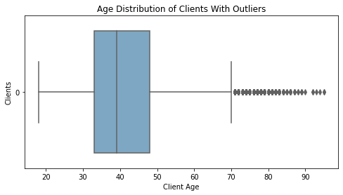
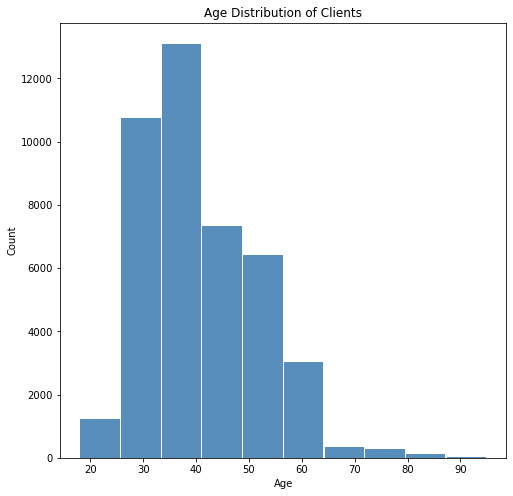
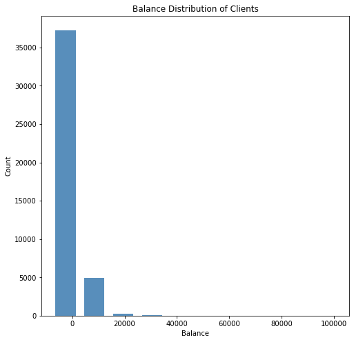
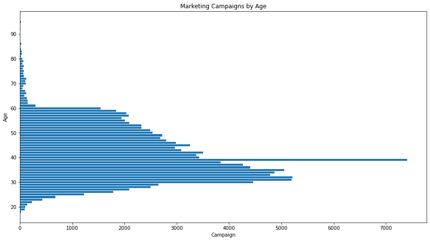
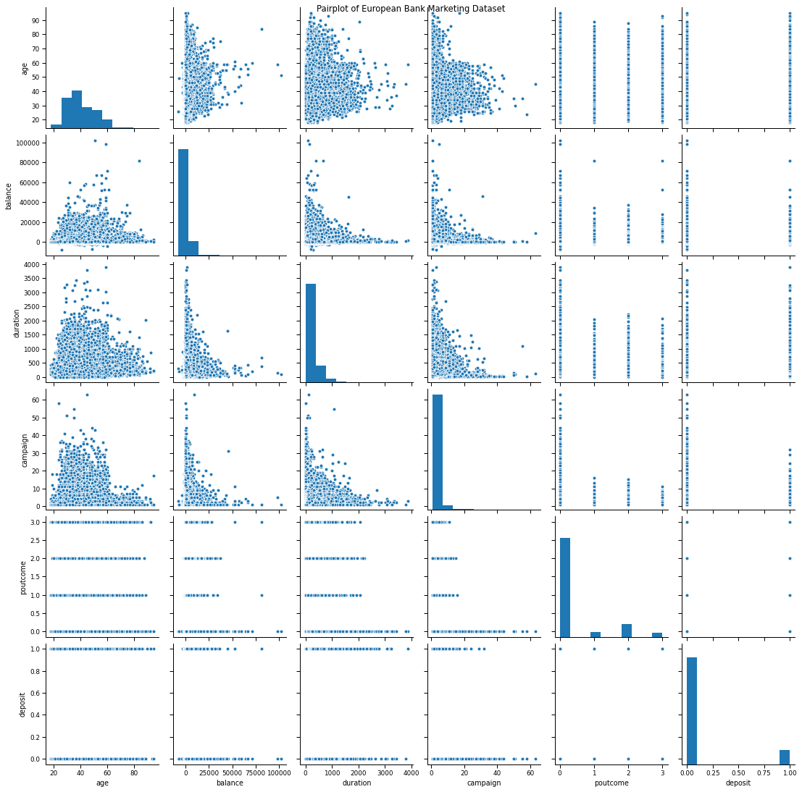
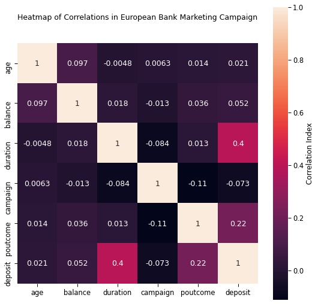
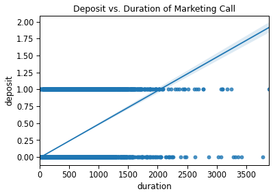

# European Bank Dataset

## Leonid Shpaner and Jose Luis Estrada

The data is related with direct marketing campaigns of a Portuguese banking institution. The marketing campaigns were based on phone calls. 
Often, more than one contact to the same client was required, in order to access if the product (bank term deposit) would be (or not) subscribed. 
The dataset is ordered by date (from May 2008 to November 2010).

### 1.	Data Importing and Pre-processing


```python
# First we import the necessary packages
import pandas as pd
import numpy as np
import seaborn as sns
import matplotlib.pyplot as plt
import statsmodels.api as sm
import sklearn
from sklearn.model_selection import train_test_split
from sklearn.feature_selection import RFE
from sklearn.linear_model import LogisticRegression
from imblearn.over_sampling import SMOTE
%matplotlib inline
```

### Importing the dataset and describing characteristics such as dimensions, data types, file types, and import methods used

<font color = blue> The .csv file which is separated by semicolons is loaded into a new dataframe, as required:


```python
eurobank = pd.read_csv('bank_marketing.csv', sep=';')
```


```python
eurobank.head()
```


<div>

<table border="1" class="dataframe">
  <thead>
    <tr style="text-align: right;">
      <th></th>
      <th>age</th>
      <th>job</th>
      <th>marital</th>
      <th>education</th>
      <th>default</th>
      <th>balance</th>
      <th>housing</th>
      <th>loan</th>
      <th>contact</th>
      <th>day</th>
      <th>month</th>
      <th>duration</th>
      <th>campaign</th>
      <th>pdays</th>
      <th>previous</th>
      <th>poutcome</th>
      <th>deposit</th>
    </tr>
  </thead>
  <tbody>
    <tr>
      <th>0</th>
      <td>58.0</td>
      <td>management</td>
      <td>married</td>
      <td>tertiary</td>
      <td>no</td>
      <td>2143</td>
      <td>yes</td>
      <td>no</td>
      <td>unknown</td>
      <td>5</td>
      <td>may</td>
      <td>261</td>
      <td>1</td>
      <td>-1</td>
      <td>0</td>
      <td>unknown</td>
      <td>no</td>
    </tr>
    <tr>
      <th>1</th>
      <td>44.0</td>
      <td>technician</td>
      <td>single</td>
      <td>secondary</td>
      <td>no</td>
      <td>29</td>
      <td>yes</td>
      <td>no</td>
      <td>unknown</td>
      <td>5</td>
      <td>may</td>
      <td>151</td>
      <td>1</td>
      <td>-1</td>
      <td>0</td>
      <td>unknown</td>
      <td>no</td>
    </tr>
    <tr>
      <th>2</th>
      <td>33.0</td>
      <td>entrepreneur</td>
      <td>married</td>
      <td>secondary</td>
      <td>no</td>
      <td>2</td>
      <td>yes</td>
      <td>yes</td>
      <td>unknown</td>
      <td>5</td>
      <td>may</td>
      <td>76</td>
      <td>1</td>
      <td>-1</td>
      <td>0</td>
      <td>unknown</td>
      <td>no</td>
    </tr>
    <tr>
      <th>3</th>
      <td>47.0</td>
      <td>blue-collar</td>
      <td>married</td>
      <td>unknown</td>
      <td>no</td>
      <td>1506</td>
      <td>yes</td>
      <td>no</td>
      <td>unknown</td>
      <td>5</td>
      <td>may</td>
      <td>92</td>
      <td>1</td>
      <td>-1</td>
      <td>0</td>
      <td>unknown</td>
      <td>no</td>
    </tr>
    <tr>
      <th>4</th>
      <td>33.0</td>
      <td>unknown</td>
      <td>single</td>
      <td>unknown</td>
      <td>no</td>
      <td>1</td>
      <td>no</td>
      <td>no</td>
      <td>NaN</td>
      <td>5</td>
      <td>may</td>
      <td>198</td>
      <td>1</td>
      <td>-1</td>
      <td>0</td>
      <td>unknown</td>
      <td>no</td>
    </tr>
  </tbody>
</table>
</div>


<font color = blue> After examining the first five rows of data to add a visual point of reference, the shape of the dataset is inspected at precisely 45,211 rows and 17 columns.


```python
print(eurobank.shape)
```

    (45211, 17)
    

<font color = blue> Further examination yields that most of the columns (variables) presented herein are objects, as stated explicitly by the datatypes call on the "eurobank" data frame (eurobank.dtypes). These objects are categorical variables. Only six out of seventeen columns are presented numerically as integers (int64). Only one other numerical variable is presented as a floating number with two decimal places (float64).


```python
eurobank.dtypes
```


    age          float64
    job           object
    marital       object
    education     object
    default       object
    balance        int64
    housing       object
    loan          object
    contact       object
    day            int64
    month         object
    duration       int64
    campaign       int64
    pdays          int64
    previous       int64
    poutcome      object
    deposit       object
    dtype: object


### Cleaning, wrangling, and handling missing data

<font color = blue> Next, a determination is made on which columns have missing values by running the following code:


```python
eurobank.isnull().sum()
```


    age          1339
    job             0
    marital         0
    education       0
    default      1306
    balance         0
    housing         0
    loan            0
    contact      1383
    day             0
    month           0
    duration        0
    campaign        0
    pdays           0
    previous        0
    poutcome        0
    deposit         0
    dtype: int64


<font color = blue> To handle missing values, we drop NA's for the 'default' and 'contact' variables and fill missing numerical values for age with median age values to smooth the data as shown below:


```python
eurobank.dropna(subset=['default', 'contact'], inplace=True)                  
eurobank['age'].fillna(int(eurobank['age'].median()), inplace=True)
```

### Reducing redundant data and performing need based discretization

<font color = blue> Taking a further look, we determine that several of the following variables are of no consequence to the marketing campaign's efficacy. For example, the housing and loan variables pertain to binary loan categories and are redundant because they are essentially reporting the same metrics. Whether a person has a loan at a bank or if it is tied to housing does not have any bearing or impact on this particular marketing outreach. There is enough information to move forward with establishing relationships between variables. Similarly, the contact variable is omitted because the contact method (cellular, telephone, and unknown) does not provide much relevant information. Day and month would present some interesting findings. However, since this dataset is explicitly between the range of years 2008 - 2010, these parameters are not well-defined to provide which year they belong to; hence, we omit them from the model. Lastly, 'pdays', and 'previous' refer to contact tracing via the number of days. This exercise aims to establish the outcome of the marketing campaign via demographic representation, outreach, and subscription to the product. Thus, the following relevant columns are included in a new subset to help achieve this goal.


```python
cols_to_include = ['age', 'job','marital', 'education', 'default', 'balance', 'duration', 'campaign', 'poutcome','deposit']

eurobank2 = eurobank[cols_to_include]
eurobank2.head()
```


<div>

<table border="1" class="dataframe">
  <thead>
    <tr style="text-align: right;">
      <th></th>
      <th>age</th>
      <th>job</th>
      <th>marital</th>
      <th>education</th>
      <th>default</th>
      <th>balance</th>
      <th>duration</th>
      <th>campaign</th>
      <th>poutcome</th>
      <th>deposit</th>
    </tr>
  </thead>
  <tbody>
    <tr>
      <th>0</th>
      <td>58.0</td>
      <td>management</td>
      <td>married</td>
      <td>tertiary</td>
      <td>no</td>
      <td>2143</td>
      <td>261</td>
      <td>1</td>
      <td>unknown</td>
      <td>no</td>
    </tr>
    <tr>
      <th>1</th>
      <td>44.0</td>
      <td>technician</td>
      <td>single</td>
      <td>secondary</td>
      <td>no</td>
      <td>29</td>
      <td>151</td>
      <td>1</td>
      <td>unknown</td>
      <td>no</td>
    </tr>
    <tr>
      <th>2</th>
      <td>33.0</td>
      <td>entrepreneur</td>
      <td>married</td>
      <td>secondary</td>
      <td>no</td>
      <td>2</td>
      <td>76</td>
      <td>1</td>
      <td>unknown</td>
      <td>no</td>
    </tr>
    <tr>
      <th>3</th>
      <td>47.0</td>
      <td>blue-collar</td>
      <td>married</td>
      <td>unknown</td>
      <td>no</td>
      <td>1506</td>
      <td>92</td>
      <td>1</td>
      <td>unknown</td>
      <td>no</td>
    </tr>
    <tr>
      <th>5</th>
      <td>35.0</td>
      <td>management</td>
      <td>married</td>
      <td>tertiary</td>
      <td>no</td>
      <td>231</td>
      <td>139</td>
      <td>1</td>
      <td>unknown</td>
      <td>no</td>
    </tr>
  </tbody>
</table>
</div>


<font color=blue> In the accompanying table, deposit outcome is examined by age group. Whereas clients between the ages of 35-40 made 962 deposits, the subscription rate is only 11%. The highest percent of deposits in any age group are equal for 18-20 year olds and those 75+ years old, tying them both at a 42% subscription rate. Given larger numbers of customers in these age brackets, this can very well change. However, targeted marketing for those age groups may prove beneficial.


```python
print("\033[1m"+'Deposit Outcome by Age (Maximum Values):'+"\033[1m")

def deposit_by_age():
    pd.options.mode.chained_assignment = None  # default='warn'
    bins = [18, 20, 25, 30, 35, 40, 45, 50, 55, 60, 65, 70, 75]
    names = ['18-20', '20-25', '25-30', '30-35', '35-40', \
            '40-45', '45-50', '50-55', '55-60', '60-65', '65-70', '70-75', '75+']

    d = dict(enumerate(names, 1))
    eurobank2['Age Range'] = np.vectorize(d.get)(np.digitize(eurobank2['age'],bins))

    deposit_yes = eurobank2.loc[eurobank2.deposit == 'yes'].groupby(['Age Range'])[['deposit']].count()
    deposit_yes.rename(columns={'deposit':'Deposit'}, inplace=True)

    deposit_no = eurobank2.loc[eurobank2.deposit == 'no'].groupby(['Age Range'])[['deposit']].count()
    deposit_no.rename(columns={'deposit':'No Deposit'}, inplace=True)

    merged_df = pd.concat([deposit_yes, deposit_no], axis = 1)
    merged_df['Deposit'] = merged_df['Deposit'].fillna(0)
    merged_df['No Deposit'] = merged_df['No Deposit'].fillna(0)
    merged_df
    max = merged_df.max()
    print(max)
    merged_df.loc['Total'] = merged_df.sum(numeric_only=True, axis=0)
    merged_df['% of Deposits'] = round((merged_df['Deposit'] / (merged_df['Deposit'] \
                                                                + merged_df['No Deposit']))* 100, 2)
    return merged_df.style.format("{:,.0f}")

deposit_by_age()
```

    Deposit Outcome by Age (Maximum Values):
    Deposit        962
    No Deposit    7945
    dtype: int64
    


<style  type="text/css" >
</style><table id="T_1e94135f_3da9_11eb_813a_ccd9accdbd32" ><thead>    <tr>        <th class="blank level0" ></th>        <th class="col_heading level0 col0" >Deposit</th>        <th class="col_heading level0 col1" >No Deposit</th>        <th class="col_heading level0 col2" >% of Deposits</th>    </tr>    <tr>        <th class="index_name level0" >Age Range</th>        <th class="blank" ></th>        <th class="blank" ></th>        <th class="blank" ></th>    </tr></thead><tbody>
                <tr>
                        <th id="T_1e94135f_3da9_11eb_813a_ccd9accdbd32level0_row0" class="row_heading level0 row0" >18-20</th>
                        <td id="T_1e94135f_3da9_11eb_813a_ccd9accdbd32row0_col0" class="data row0 col0" >18</td>
                        <td id="T_1e94135f_3da9_11eb_813a_ccd9accdbd32row0_col1" class="data row0 col1" >25</td>
                        <td id="T_1e94135f_3da9_11eb_813a_ccd9accdbd32row0_col2" class="data row0 col2" >42</td>
            </tr>
            <tr>
                        <th id="T_1e94135f_3da9_11eb_813a_ccd9accdbd32level0_row1" class="row_heading level0 row1" >20-25</th>
                        <td id="T_1e94135f_3da9_11eb_813a_ccd9accdbd32row1_col0" class="data row1 col0" >179</td>
                        <td id="T_1e94135f_3da9_11eb_813a_ccd9accdbd32row1_col1" class="data row1 col1" >527</td>
                        <td id="T_1e94135f_3da9_11eb_813a_ccd9accdbd32row1_col2" class="data row1 col2" >25</td>
            </tr>
            <tr>
                        <th id="T_1e94135f_3da9_11eb_813a_ccd9accdbd32level0_row2" class="row_heading level0 row2" >25-30</th>
                        <td id="T_1e94135f_3da9_11eb_813a_ccd9accdbd32row2_col0" class="data row2 col0" >647</td>
                        <td id="T_1e94135f_3da9_11eb_813a_ccd9accdbd32row2_col1" class="data row2 col1" >3,412</td>
                        <td id="T_1e94135f_3da9_11eb_813a_ccd9accdbd32row2_col2" class="data row2 col2" >16</td>
            </tr>
            <tr>
                        <th id="T_1e94135f_3da9_11eb_813a_ccd9accdbd32level0_row3" class="row_heading level0 row3" >30-35</th>
                        <td id="T_1e94135f_3da9_11eb_813a_ccd9accdbd32row3_col0" class="data row3 col0" >961</td>
                        <td id="T_1e94135f_3da9_11eb_813a_ccd9accdbd32row3_col1" class="data row3 col1" >7,945</td>
                        <td id="T_1e94135f_3da9_11eb_813a_ccd9accdbd32row3_col2" class="data row3 col2" >11</td>
            </tr>
            <tr>
                        <th id="T_1e94135f_3da9_11eb_813a_ccd9accdbd32level0_row4" class="row_heading level0 row4" >35-40</th>
                        <td id="T_1e94135f_3da9_11eb_813a_ccd9accdbd32row4_col0" class="data row4 col0" >962</td>
                        <td id="T_1e94135f_3da9_11eb_813a_ccd9accdbd32row4_col1" class="data row4 col1" >7,941</td>
                        <td id="T_1e94135f_3da9_11eb_813a_ccd9accdbd32row4_col2" class="data row4 col2" >11</td>
            </tr>
            <tr>
                        <th id="T_1e94135f_3da9_11eb_813a_ccd9accdbd32level0_row5" class="row_heading level0 row5" >40-45</th>
                        <td id="T_1e94135f_3da9_11eb_813a_ccd9accdbd32row5_col0" class="data row5 col0" >492</td>
                        <td id="T_1e94135f_3da9_11eb_813a_ccd9accdbd32row5_col1" class="data row5 col1" >5,186</td>
                        <td id="T_1e94135f_3da9_11eb_813a_ccd9accdbd32row5_col2" class="data row5 col2" >9</td>
            </tr>
            <tr>
                        <th id="T_1e94135f_3da9_11eb_813a_ccd9accdbd32level0_row6" class="row_heading level0 row6" >45-50</th>
                        <td id="T_1e94135f_3da9_11eb_813a_ccd9accdbd32row6_col0" class="data row6 col0" >483</td>
                        <td id="T_1e94135f_3da9_11eb_813a_ccd9accdbd32row6_col1" class="data row6 col1" >4,520</td>
                        <td id="T_1e94135f_3da9_11eb_813a_ccd9accdbd32row6_col2" class="data row6 col2" >10</td>
            </tr>
            <tr>
                        <th id="T_1e94135f_3da9_11eb_813a_ccd9accdbd32level0_row7" class="row_heading level0 row7" >50-55</th>
                        <td id="T_1e94135f_3da9_11eb_813a_ccd9accdbd32row7_col0" class="data row7 col0" >365</td>
                        <td id="T_1e94135f_3da9_11eb_813a_ccd9accdbd32row7_col1" class="data row7 col1" >3,709</td>
                        <td id="T_1e94135f_3da9_11eb_813a_ccd9accdbd32row7_col2" class="data row7 col2" >9</td>
            </tr>
            <tr>
                        <th id="T_1e94135f_3da9_11eb_813a_ccd9accdbd32level0_row8" class="row_heading level0 row8" >55-60</th>
                        <td id="T_1e94135f_3da9_11eb_813a_ccd9accdbd32row8_col0" class="data row8 col0" >345</td>
                        <td id="T_1e94135f_3da9_11eb_813a_ccd9accdbd32row8_col1" class="data row8 col1" >3,230</td>
                        <td id="T_1e94135f_3da9_11eb_813a_ccd9accdbd32row8_col2" class="data row8 col2" >10</td>
            </tr>
            <tr>
                        <th id="T_1e94135f_3da9_11eb_813a_ccd9accdbd32level0_row9" class="row_heading level0 row9" >60-65</th>
                        <td id="T_1e94135f_3da9_11eb_813a_ccd9accdbd32row9_col0" class="data row9 col0" >237</td>
                        <td id="T_1e94135f_3da9_11eb_813a_ccd9accdbd32row9_col1" class="data row9 col1" >656</td>
                        <td id="T_1e94135f_3da9_11eb_813a_ccd9accdbd32row9_col2" class="data row9 col2" >27</td>
            </tr>
            <tr>
                        <th id="T_1e94135f_3da9_11eb_813a_ccd9accdbd32level0_row10" class="row_heading level0 row10" >65-70</th>
                        <td id="T_1e94135f_3da9_11eb_813a_ccd9accdbd32row10_col0" class="data row10 col0" >92</td>
                        <td id="T_1e94135f_3da9_11eb_813a_ccd9accdbd32row10_col1" class="data row10 col1" >141</td>
                        <td id="T_1e94135f_3da9_11eb_813a_ccd9accdbd32row10_col2" class="data row10 col2" >39</td>
            </tr>
            <tr>
                        <th id="T_1e94135f_3da9_11eb_813a_ccd9accdbd32level0_row11" class="row_heading level0 row11" >70-75</th>
                        <td id="T_1e94135f_3da9_11eb_813a_ccd9accdbd32row11_col0" class="data row11 col0" >92</td>
                        <td id="T_1e94135f_3da9_11eb_813a_ccd9accdbd32row11_col1" class="data row11 col1" >137</td>
                        <td id="T_1e94135f_3da9_11eb_813a_ccd9accdbd32row11_col2" class="data row11 col2" >40</td>
            </tr>
            <tr>
                        <th id="T_1e94135f_3da9_11eb_813a_ccd9accdbd32level0_row12" class="row_heading level0 row12" >75+</th>
                        <td id="T_1e94135f_3da9_11eb_813a_ccd9accdbd32row12_col0" class="data row12 col0" >112</td>
                        <td id="T_1e94135f_3da9_11eb_813a_ccd9accdbd32row12_col1" class="data row12 col1" >155</td>
                        <td id="T_1e94135f_3da9_11eb_813a_ccd9accdbd32row12_col2" class="data row12 col2" >42</td>
            </tr>
            <tr>
                        <th id="T_1e94135f_3da9_11eb_813a_ccd9accdbd32level0_row13" class="row_heading level0 row13" >Total</th>
                        <td id="T_1e94135f_3da9_11eb_813a_ccd9accdbd32row13_col0" class="data row13 col0" >4,985</td>
                        <td id="T_1e94135f_3da9_11eb_813a_ccd9accdbd32row13_col1" class="data row13 col1" >37,584</td>
                        <td id="T_1e94135f_3da9_11eb_813a_ccd9accdbd32row13_col2" class="data row13 col2" >12</td>
            </tr>
    </tbody></table>


### Transforming data appropriately using techniques such as aggregation, normalization, and feature construction

<font color = blue> The summary statistics table broken down by job type is presented below.
While there are several ways to aggregate this data, looking at balances by job category sheds light on summary statistics like mean, median, and standard deviation. For example, clients that are retired exhibit the highest mean bank balance of 1,963.06. The next highest mean bank balance of 1,794.90 is for individuals who did not specify their career profiles (unknown). Whereas the third-highest recorded mean bank balance of 1,768.30 is for management professionals. Given that retirement income, visa vie savings generally produces larger bank balances, this make sense contextually. On average, management professionals are higher wage earners than hourly positions, larger bank balances make sense for this sample as well. The interesting finding here is that blue-collar workers recorded lower average bank balances (1,079.62) than those that are unemployed (1,499.55).  The same job category rankings are shown for median recorded bank balances, but the balances themselves are all below 1,000.00. 

The highest standard deviation is that of 4,420.12 for retired individuals, suggesting that it is dispersed over a wider range of values and further away from the mean. This makes sense because tracking retirement income, generally speaking, casts a wide net over an abstract group of individuals. Similar assertions can be made about entrepreneurs to capture a broad category; their standard deviation is recorded as 4,242.79.


```python
print("\033[1m"+'Bank Balance Summary Statistics by Job:'+"\033[1m")

def summary_by_job():
    pd.options.display.float_format = '{:,.2f}'.format
    cols_to_include = ['age', 'job','marital', 'education', 'default', 'balance', 'duration',\
                       'campaign', 'poutcome','deposit']

    new = eurobank[cols_to_include]
    new = new.groupby('job')['balance'].agg(["mean", "median", "std", "min", "max"])
    new.loc['Total'] = new.sum(numeric_only=True, axis=0)
    column_rename = {'mean': 'Mean', 'median': 'Median','std': 'Standard Deviation',\
                     'min':'Minimum','max': 'Maximum'}
    dfsummary = new.rename(columns = column_rename)
    new
    return dfsummary

summary_by_job()
```

    Bank Balance Summary Statistics by Job:
    


<div>

<table border="1" class="dataframe">
  <thead>
    <tr style="text-align: right;">
      <th></th>
      <th>Mean</th>
      <th>Median</th>
      <th>Standard Deviation</th>
      <th>Minimum</th>
      <th>Maximum</th>
    </tr>
    <tr>
      <th>job</th>
      <th></th>
      <th></th>
      <th></th>
      <th></th>
      <th></th>
    </tr>
  </thead>
  <tbody>
    <tr>
      <th>admin.</th>
      <td>1,141.83</td>
      <td>401.00</td>
      <td>2,682.21</td>
      <td>-1,601.00</td>
      <td>64,343.00</td>
    </tr>
    <tr>
      <th>blue-collar</th>
      <td>1,079.62</td>
      <td>390.00</td>
      <td>2,249.38</td>
      <td>-8,019.00</td>
      <td>66,653.00</td>
    </tr>
    <tr>
      <th>entrepreneur</th>
      <td>1,554.25</td>
      <td>358.50</td>
      <td>4,242.79</td>
      <td>-2,082.00</td>
      <td>59,649.00</td>
    </tr>
    <tr>
      <th>housemaid</th>
      <td>1,393.90</td>
      <td>399.00</td>
      <td>3,028.83</td>
      <td>-1,941.00</td>
      <td>45,141.00</td>
    </tr>
    <tr>
      <th>management</th>
      <td>1,768.30</td>
      <td>572.00</td>
      <td>3,846.95</td>
      <td>-6,847.00</td>
      <td>102,127.00</td>
    </tr>
    <tr>
      <th>retired</th>
      <td>1,963.06</td>
      <td>771.00</td>
      <td>4,420.12</td>
      <td>-1,598.00</td>
      <td>81,204.00</td>
    </tr>
    <tr>
      <th>self-employed</th>
      <td>1,646.29</td>
      <td>526.00</td>
      <td>3,659.48</td>
      <td>-3,313.00</td>
      <td>52,587.00</td>
    </tr>
    <tr>
      <th>services</th>
      <td>1,002.60</td>
      <td>339.00</td>
      <td>2,186.20</td>
      <td>-2,122.00</td>
      <td>57,435.00</td>
    </tr>
    <tr>
      <th>student</th>
      <td>1,386.08</td>
      <td>492.00</td>
      <td>2,468.55</td>
      <td>-679.00</td>
      <td>24,025.00</td>
    </tr>
    <tr>
      <th>technician</th>
      <td>1,250.14</td>
      <td>422.00</td>
      <td>2,530.20</td>
      <td>-2,827.00</td>
      <td>45,248.00</td>
    </tr>
    <tr>
      <th>unemployed</th>
      <td>1,499.55</td>
      <td>532.50</td>
      <td>3,124.95</td>
      <td>-1,270.00</td>
      <td>44,134.00</td>
    </tr>
    <tr>
      <th>unknown</th>
      <td>1,794.90</td>
      <td>690.00</td>
      <td>3,011.71</td>
      <td>-295.00</td>
      <td>19,706.00</td>
    </tr>
    <tr>
      <th>Total</th>
      <td>17,480.51</td>
      <td>5,893.00</td>
      <td>37,451.37</td>
      <td>-32,594.00</td>
      <td>662,252.00</td>
    </tr>
  </tbody>
</table>
</div>


<font color = blue> The summary statistics of bank balances by marital status show that married individuals have the highest average bank balance. In contrast, individuals who are single have the second-highest average bank balance. Divorced couples are shown as having the lowest average bank balance, perhaps in part due to income loss from legal filings, paperwork, and attorney fees. Ranking information (highest to lowest) for median bank balances is the same; however, the balances themselves are lower. Whereas married couples show the highest average bank balances, the mean (standard deviation) variance is also the highest in this category.


```python
print("\033[1m"+'Bank Balance Summary Statistics by Marital Status:'+"\033[1m")

def summary_by_marital():
    pd.options.display.float_format = '{:,.2f}'.format
    new2 = eurobank2.groupby('marital')['balance'].agg(["mean", "median", "std", "min", "max"])
    new2.loc['Total'] = new2.sum(numeric_only=True, axis=0)
    column_rename = {'mean': 'Mean', 'median': 'Median','std': 'Standard Deviation',\
                         'min':'Minimum','max': 'Maximum'}
    dfsummary2 = new2.rename(columns = column_rename)
    return dfsummary2
    
summary_by_marital()
```

    Bank Balance Summary Statistics by Marital Status:
    


<div>

<table border="1" class="dataframe">
  <thead>
    <tr style="text-align: right;">
      <th></th>
      <th>Mean</th>
      <th>Median</th>
      <th>Standard Deviation</th>
      <th>Minimum</th>
      <th>Maximum</th>
    </tr>
    <tr>
      <th>marital</th>
      <th></th>
      <th></th>
      <th></th>
      <th></th>
      <th></th>
    </tr>
  </thead>
  <tbody>
    <tr>
      <th>divorced</th>
      <td>1,179.32</td>
      <td>353.00</td>
      <td>2,943.52</td>
      <td>-4,057.00</td>
      <td>66,721.00</td>
    </tr>
    <tr>
      <th>married</th>
      <td>1,427.87</td>
      <td>477.00</td>
      <td>3,160.23</td>
      <td>-6,847.00</td>
      <td>98,417.00</td>
    </tr>
    <tr>
      <th>single</th>
      <td>1,302.96</td>
      <td>441.00</td>
      <td>2,886.05</td>
      <td>-8,019.00</td>
      <td>102,127.00</td>
    </tr>
    <tr>
      <th>Total</th>
      <td>3,910.15</td>
      <td>1,271.00</td>
      <td>8,989.79</td>
      <td>-18,923.00</td>
      <td>267,265.00</td>
    </tr>
  </tbody>
</table>
</div>


<font color=blue> The table below illustrates deposits by marital status. In examining this data, one must consider what all of this means from a marketing perspective. Each campaign has its unique premise for onboarding new clients to higher-tier services and offerings; hence this is why large conglomerate banks have promotional offers visa vie sales calls, pamphlets, and other promotional materials. In this case, the outcome of a successful campaign is that of a customer making a deposit. 

Furthermore, it becomes apparent that the highest recorded deposits come from married clients (2,601), but even a larger (the largest at 23,050) share of non-deposits also come from married clients. Only 10% of married clients subscribed to this marketing campaign, the lowest subscription rate by marital status category. Divorced customers, the lowest count of all marital categories, came in second with an overall 12% subscription rate. Single clients subscribed at the highest rate of 15% by making 1,794 deposits. There were only 12,017 single clients, which is why this metric was higher than the rest. All in all, 12% (counted as 4,985) of all 42,569 clients made a deposit, thereby subscribing to this marketing campaign.


```python
print("\033[1m"+'Deposit Outcome by Marital Status:'+"\033[1m")

def deposit_by_marital():
    marital_status_yes = eurobank2.loc[eurobank2.deposit == 'yes'].groupby\
    (['marital'])[['deposit']].count()
    marital_status_yes.rename(columns={'deposit':'Deposit'}, inplace=True)
    marital_status_no = eurobank2.loc[eurobank2.deposit == 'no'].groupby\
    (['marital'])[['deposit']].count()
    marital_status_no.rename(columns={'deposit':'No Deposit'}, inplace=True)
    merged_df = pd.concat([marital_status_yes, marital_status_no], axis = 1)
    merged_df.loc['Total'] = merged_df.sum(numeric_only=True, axis=0)
    merged_df['# of Clients'] = merged_df.sum(axis=1)
    merged_df['% Deposited'] = round((merged_df['Deposit'] / (merged_df['Deposit'] \
                                                              + merged_df['No Deposit']))* 100, 2)
    return merged_df.style.format("{:,.0f}")

deposit_by_marital()
```

    Deposit Outcome by Marital Status:
    


<style  type="text/css" >
</style><table id="T_1ea6f1ed_3da9_11eb_8c96_ccd9accdbd32" ><thead>    <tr>        <th class="blank level0" ></th>        <th class="col_heading level0 col0" >Deposit</th>        <th class="col_heading level0 col1" >No Deposit</th>        <th class="col_heading level0 col2" ># of Clients</th>        <th class="col_heading level0 col3" >% Deposited</th>    </tr>    <tr>        <th class="index_name level0" >marital</th>        <th class="blank" ></th>        <th class="blank" ></th>        <th class="blank" ></th>        <th class="blank" ></th>    </tr></thead><tbody>
                <tr>
                        <th id="T_1ea6f1ed_3da9_11eb_8c96_ccd9accdbd32level0_row0" class="row_heading level0 row0" >divorced</th>
                        <td id="T_1ea6f1ed_3da9_11eb_8c96_ccd9accdbd32row0_col0" class="data row0 col0" >590</td>
                        <td id="T_1ea6f1ed_3da9_11eb_8c96_ccd9accdbd32row0_col1" class="data row0 col1" >4,311</td>
                        <td id="T_1ea6f1ed_3da9_11eb_8c96_ccd9accdbd32row0_col2" class="data row0 col2" >4,901</td>
                        <td id="T_1ea6f1ed_3da9_11eb_8c96_ccd9accdbd32row0_col3" class="data row0 col3" >12</td>
            </tr>
            <tr>
                        <th id="T_1ea6f1ed_3da9_11eb_8c96_ccd9accdbd32level0_row1" class="row_heading level0 row1" >married</th>
                        <td id="T_1ea6f1ed_3da9_11eb_8c96_ccd9accdbd32row1_col0" class="data row1 col0" >2,601</td>
                        <td id="T_1ea6f1ed_3da9_11eb_8c96_ccd9accdbd32row1_col1" class="data row1 col1" >23,050</td>
                        <td id="T_1ea6f1ed_3da9_11eb_8c96_ccd9accdbd32row1_col2" class="data row1 col2" >25,651</td>
                        <td id="T_1ea6f1ed_3da9_11eb_8c96_ccd9accdbd32row1_col3" class="data row1 col3" >10</td>
            </tr>
            <tr>
                        <th id="T_1ea6f1ed_3da9_11eb_8c96_ccd9accdbd32level0_row2" class="row_heading level0 row2" >single</th>
                        <td id="T_1ea6f1ed_3da9_11eb_8c96_ccd9accdbd32row2_col0" class="data row2 col0" >1,794</td>
                        <td id="T_1ea6f1ed_3da9_11eb_8c96_ccd9accdbd32row2_col1" class="data row2 col1" >10,223</td>
                        <td id="T_1ea6f1ed_3da9_11eb_8c96_ccd9accdbd32row2_col2" class="data row2 col2" >12,017</td>
                        <td id="T_1ea6f1ed_3da9_11eb_8c96_ccd9accdbd32row2_col3" class="data row2 col3" >15</td>
            </tr>
            <tr>
                        <th id="T_1ea6f1ed_3da9_11eb_8c96_ccd9accdbd32level0_row3" class="row_heading level0 row3" >Total</th>
                        <td id="T_1ea6f1ed_3da9_11eb_8c96_ccd9accdbd32row3_col0" class="data row3 col0" >4,985</td>
                        <td id="T_1ea6f1ed_3da9_11eb_8c96_ccd9accdbd32row3_col1" class="data row3 col1" >37,584</td>
                        <td id="T_1ea6f1ed_3da9_11eb_8c96_ccd9accdbd32row3_col2" class="data row3 col2" >42,569</td>
                        <td id="T_1ea6f1ed_3da9_11eb_8c96_ccd9accdbd32row3_col3" class="data row3 col3" >12</td>
            </tr>
    </tbody></table>


### 2. Data Analysis and Visualization

### Identifying categorical, ordinal, and numerical variables within data

<font color = blue> Upon further examination of the dataset once again in its entirety, it is apparent that each variable (column) has its unique characteristics in terms of type. For example, whereas age, balance, duration, campaign, pdays, and previous are numerical variables, some are not. To this point, job, marital, education, default, housing, loan, contact, poutcome, and deposit are categorical variables. Month, on the other hand, though categorical at first glance, is truly an ordinal variable, as it follows a strict order. To aide in the determination of each, 'eurobank.dtypes', and 'eurobank.head()' functions were already run in the prior section. </font>

<font color = blue> The following code block examines the summary statistics as measures of centrality for the selected variables. The average age of the bank's clients is approximately 41 years old, which is only about two years older than the median, so there is no remarkable difference. The minimum age is 18, which makes sense because that is close to the minimum age when banking clients can open new accounts. Not surprisingly, the maximum age of the clientele is 95 years old.


```python
summary_stats = round(eurobank2.describe().T,2)
summary_stats.drop(['count'], axis=1, inplace=True)
summary_stats.rename (columns={'mean':'Mean', 'std': 'Standard Deviation', 'min': 'Minimum', \
                               '25%':'Q1', '50%': 'Median', '75%':'Q3', 'max':'Maximum'}, inplace=True)
summary_stats
```


<div>

<table border="1" class="dataframe">
  <thead>
    <tr style="text-align: right;">
      <th></th>
      <th>Mean</th>
      <th>Standard Deviation</th>
      <th>Minimum</th>
      <th>Q1</th>
      <th>Median</th>
      <th>Q3</th>
      <th>Maximum</th>
    </tr>
  </thead>
  <tbody>
    <tr>
      <th>age</th>
      <td>40.86</td>
      <td>10.44</td>
      <td>18.00</td>
      <td>33.00</td>
      <td>39.00</td>
      <td>48.00</td>
      <td>95.00</td>
    </tr>
    <tr>
      <th>balance</th>
      <td>1,363.99</td>
      <td>3,061.66</td>
      <td>-8,019.00</td>
      <td>72.00</td>
      <td>450.00</td>
      <td>1,430.00</td>
      <td>102,127.00</td>
    </tr>
    <tr>
      <th>duration</th>
      <td>258.32</td>
      <td>257.19</td>
      <td>0.00</td>
      <td>103.00</td>
      <td>180.00</td>
      <td>319.00</td>
      <td>3,881.00</td>
    </tr>
    <tr>
      <th>campaign</th>
      <td>2.76</td>
      <td>3.09</td>
      <td>1.00</td>
      <td>1.00</td>
      <td>2.00</td>
      <td>3.00</td>
      <td>63.00</td>
    </tr>
  </tbody>
</table>
</div>


### Providing measures of centrality and distribution with visualizations

<font color='blue'>We examine the age distribution visually as a boxplot, and though it is normally distributed, it is skewed to the right.</font>


```python
# Boxplot of age as another way of showing distribution
fig = plt.figure(figsize = (8,4))
plt.title ('Age Distribution of Clients With Outliers')
plt.xlabel('Client Age')
plt.ylabel('Clients')

sns.boxplot(data=eurobank2['age'], palette="PuBu", orient='h')
plt.show()

# Computing IQR
Q1 = eurobank2['age'].quantile(0.25)
Q3 = eurobank2['age'].quantile(0.75)
IQR = Q3-Q1

# Computing Summary Statistics
mean_1 = round(eurobank2['age'].mean(),2)
std_1 = round(eurobank2['age'].std(),2)
median_1 = round(eurobank2['age'].median(),2)
print('The first quartile is %s. '%Q1)
print('The third quartile is %s. '%Q3)
print('The IQR is %s.'%IQR)
print('The mean is %s.'%mean_1)
print('The standard deviation is %s.'%std_1)
print('The median is %s.'%median_1)
```





    The first quartile is 33.0. 
    The third quartile is 48.0. 
    The IQR is 15.0.
    The mean is 40.86.
    The standard deviation is 10.44.
    The median is 39.0.
    

<font color = 'blue'> Some outliers from past the age of 70 onward suggest that older clients past retirement age are few and far in between. These outliers are subsetted into a new data frame to examine the means of ages with and without them as bases of comparison.


```python
lower_bound = Q1-(1.5*IQR)
upper_bound = Q3+(1.5*IQR)

outliers_eurobank2 = eurobank2.loc[(eurobank2['age'] < lower_bound) | (eurobank2['age'] > upper_bound)]
average_age = round(eurobank2.age.mean(), 2)
print('The average of age in the original data frame is %s.' % average_age)

average_age_outliers_eurobank2 = round(outliers_eurobank2.age.mean(),2)
print('The average of age of outliers is %s.' % average_age_outliers_eurobank2)
```

    The average of age in the original data frame is 40.86.
    The average of age of outliers is 76.8.
    

<font color = 'blue'> The average age of clients as outliers in this dataset is 76.8 years old. In this analysis, while we are generally interested in data sensitive to outliers, we are equally interested in examining the dataset that is resistant to these outliers as a basis of comparison.

<font color = 'blue'> Removing the outliers from the age variable yields little observable significance, as shown below. For example, the average age has only been reduced by 0.37, the standard deviation by 0.62, with no difference in the median age with or without outliers.


```python
# Boxplot of age without outliers as another way of showing distribution
fig = plt.figure(figsize = (8,4))
plt.title ('Age Distribution of Clients Without Outliers')
plt.xlabel('Client Age')
plt.ylabel('Clients')
sns.boxplot(data=eurobank2['age'], palette="PuBu", orient='h', showfliers = False)
plt.show()

filter = (eurobank2['age'] >= Q1 - 1.5 * IQR) & (eurobank2['age'] <= Q3 + 1.5 *IQR)
summary_stats_2 = round(eurobank2.loc[filter].describe().T,2)
summary_stats_2.drop(['count'], axis=1, inplace=True)
summary_stats_2.rename (columns={'mean':'Mean', 'std': 'Standard Deviation', 'min': 'Minimum', \
                                 '25%':'Q1', '50%': 'Median', '75%':'Q3', 'max':'Maximum'}, inplace=True)
summary_stats_2
```


<div>
<style scoped>
    .dataframe tbody tr th:only-of-type {
        vertical-align: middle;
    }

    .dataframe tbody tr th {
        vertical-align: top;
    }

    .dataframe thead th {
        text-align: right;
    }
</style>
<table border="1" class="dataframe">
  <thead>
    <tr style="text-align: right;">
      <th></th>
      <th>Mean</th>
      <th>Standard Deviation</th>
      <th>Minimum</th>
      <th>Q1</th>
      <th>Median</th>
      <th>Q3</th>
      <th>Maximum</th>
    </tr>
  </thead>
  <tbody>
    <tr>
      <th>age</th>
      <td>40.49</td>
      <td>9.82</td>
      <td>18.00</td>
      <td>33.00</td>
      <td>39.00</td>
      <td>48.00</td>
      <td>70.00</td>
    </tr>
    <tr>
      <th>balance</th>
      <td>1,347.12</td>
      <td>2,996.60</td>
      <td>-8,019.00</td>
      <td>71.00</td>
      <td>444.00</td>
      <td>1,411.00</td>
      <td>102,127.00</td>
    </tr>
    <tr>
      <th>duration</th>
      <td>257.48</td>
      <td>256.99</td>
      <td>0.00</td>
      <td>103.00</td>
      <td>179.00</td>
      <td>318.00</td>
      <td>3,881.00</td>
    </tr>
    <tr>
      <th>campaign</th>
      <td>2.77</td>
      <td>3.10</td>
      <td>1.00</td>
      <td>1.00</td>
      <td>2.00</td>
      <td>3.00</td>
      <td>63.00</td>
    </tr>
  </tbody>
</table>
</div>


```python
# Computing Means, Standard Deviations, and Observing Differences
mean_2 = round(eurobank2.loc[filter]['age'].mean(),2)
mean_difference = round((mean_1 - mean_2),2)
std_2 = round(eurobank2.loc[filter]['age'].std(),2)
std_difference = round((std_1 - std_2),2)
median_2 = round(eurobank2.loc[filter]['age'].median(),2)
median_difference = round((median_1 - median_2),2)

print('The mean age without outliers is %s.'%mean_2)
print('The standard deviation of the age variable without outliers is %s.'%std_2)
print('The median age without outliers is %s.'%median_2)

print("\n")

print('The difference between the mean with outliers and the \
mean without outliers is %s.'%mean_difference)
print('The difference between the standard deviation with outliers and the \
standard deviation without outliers is %s.'%std_difference)
print('The difference between the median with outliers and the \
median without outliers is %s.'%median_difference)
```

    The mean age without outliers is 40.49.
    The standard deviation of the age variable without outliers is 9.82.
    The median age without outliers is 39.0.
    
    
    The difference between the mean with outliers and the mean without outliers is 0.37.
    The difference between the standard deviation with outliers and the standard deviation without outliers is 0.62.
    The difference between the median with outliers and the median without outliers is 0.0.
    

<font color=blue> A histogram showing the distribution of the age variable is plotted below.


```python
# Plotting a histogram to show distribution
fig = plt.figure(figsize = (8,8))
plt.hist(eurobank['age'], bins=10, color='steelblue', alpha=0.9, rwidth=.97)
plt.title ('Age Distribution of Clients')
plt.xlabel('Age') 
plt.ylabel('Count')
plt.show()

# mode = eurobank2.mode('age', numeric_only=True)
# print('The mode is %s.'%mode)

print('The information below shows the mode for the age variable:')
eurobank.loc[:,'age'].mode()

```





    The information below shows the mode for the age variable:
    


    0   39.00
    dtype: float64


<font color = blue> There are more clients who are 39 years old than any other age. While age is one relevant variable in this dataset, it is worthwile to examine the distribution of account balances as follows:


```python
# Plotting a histogram to show distribution
fig = plt.figure(figsize = (8,8))
plt.hist(eurobank2['balance'], bins=10, color='steelblue', alpha=0.9, rwidth=0.7)
plt.title ('Balance Distribution of Clients')
plt.xlabel('Balance') 
plt.ylabel('Count')
plt.show()

print('The following values represent the number of data points between each bin:')

counts, bin_edges = np.histogram(eurobank2['balance'], bins=10)
print(counts)
```





    The following values represent the number of data points between each bin:
    [37269  4927   281    54    20     7     6     1     2     2]
    

<font color = blue> The majority of these clients have negative balances. This is not so alarming since the prior summary output table did show a minimum balance of <font color = red> -8,019.00. </font> While there appear to be only four bins in this figure, the output clearly shows otherwise. For example, most of our dataset is below \$40,000, based on the four visible bins shown above. More importantly, most of the balance is either zero or below. This can potentially yield some additional insights in terms of the marketing campaign's direction and its predictability.


```python
campaign_age = eurobank2.groupby('age', as_index=False)['campaign'].sum()
fig = plt.figure(figsize = (15,8))
plt.barh(campaign_age['age'], campaign_age['campaign'])
plt.xlabel("Campaign")
plt.ylabel("Age")
plt.title("Marketing Campaigns by Age")
plt.show()
```





### Perform exploratory analysis in combination with visualization techniques to discover patterns and features of interest

<font color = blue> Now, to prepare the dataset for a regression model, we assign numerical values to the categorical variables of deposit and prior outcome as follows:


```python
eurobank2['deposit'] = eurobank2.deposit.map(dict(yes=1, no=0))
eurobank2['poutcome'] = eurobank2.poutcome.map(dict(unknown=0, other=1, failure=2, success=3))
```

<font color = blue> Next, we examine correlations visually:


```python
sns.set_context("paper", font_scale=1)
plot = sns.pairplot(eurobank2, diag_kind='hist', dropna = True, palette='Blues')
plot.fig.suptitle("Pairplot of European Bank Marketing Dataset", y = 1.0001) 
plt.show()
```





###  Diagnosing for correlations between variables and determining independent and dependent variables

<font color = blue> At first glance it does not appear that any of these variables have any noticeable degrees of correlation. Therefore, a heatmap correlation with indices is produced below:


```python
# Examining the correlations between variables using a heat map
heatmap = eurobank2[['age','balance','duration','campaign','poutcome','deposit']]
sns.set_context("paper", rc={"axes.labelsize":12}, font_scale = 1.3)
correlations = heatmap.corr()
plt.figure(figsize = (9,9))
ax = sns.heatmap(correlations[['age','balance','duration','campaign','poutcome', 'deposit']], \
                 annot = True, square = True, cbar_kws={'label': 'Correlation Index'})
ax.set_title('Heatmap of Correlations in European Bank Marketing Campaign')
ax.set_ylim(len(correlations), -0.5)
plt.show()
```





<font color = blue> From here we can see that the duration of the marketing call is moderately correlated to the deposit (0.40). This is a moderate positive correlation. The second highest correlation is that of prior marketing campaign outcome (poutcome) to deposit (.22). This is a low positive correlation. Lastly, a low negative correlation (-.11) is seen between campaign and poutcome. 

<font color = blue> The following scatterplot modeling the moderate at best relationship between deposit and duration is produced below. An increase in the duration of the contact attempt produces a similar increase in the deposits (subscriptions) in the marketing campaign. 


```python
sns.regplot(data = eurobank2, x = 'duration', y = 'deposit')
plt.title('Deposit vs. Duration of Marketing Call')
plt.show()
print('The correlation coefficient r is equal to %s.' % \
      round(np.corrcoef(eurobank2.duration,eurobank2.deposit)[0,1], 2))
```





    The correlation coefficient r is equal to 0.4.
    

### 3.	Data Analytics

### Determining the need for a supervised or unsupervised learning method and identifying dependent and independent variables

<font color = blue> In looking at linear regression as a potential model for this dataset, a determination is made that this model holds little to no merit for its weak variable associations (relationships). Therefore, the eurobank dataset requires a logistic regression model to make predictions based on the current variables. This is an example of supervised learning. 

Since the marketing strategy focused on who opened an account and made an initial deposit, the analysis requires changing the outputs from yes and no to 1 and 0. Additionally, it will need dummy variables to help the program understand the categorical data. After the data preprocessing, the program will split the data into train and test sets to identify accuracy. Not all the variables will be selected for the final model, so the analysis will use the Recursive Feature Elimination (REF) method to reduce the number of variables.
<br>
    <br>
The final portion of the analysis will show the final model, the model's accuracy, and a confusion matrix for the overall performance of the model.


```python
# Change yes and no answers from deposit variable (column) to 0(no) and 1(yes) for linear regression
eurobank['deposit'] = eurobank.deposit.map(dict(yes=1, no=0))
```


```python
# Created dummy variables for categorical variables
categorical_variables=['job','marital','education','default','housing','loan','contact','month','poutcome']
for var in categorical_variables:
    categorical_list='var'+'_'+var
    categorical_list = pd.get_dummies(eurobank[var], prefix=var)
    eurobank10=eurobank.join(categorical_list)
    eurobank=eurobank10
categorical_variables=['job','marital','education','default','housing','loan','contact','month','poutcome']
data_vars=eurobank.columns.values.tolist()
keep=[i for i in data_vars if i not in categorical_variables]
```


```python
# Print all variables including dummy variables
data_final = eurobank[keep]
data_final.columns.values
```


    array(['age', 'balance', 'day', 'duration', 'campaign', 'pdays',
           'previous', 'deposit', 'job_admin.', 'job_blue-collar',
           'job_entrepreneur', 'job_housemaid', 'job_management',
           'job_retired', 'job_self-employed', 'job_services', 'job_student',
           'job_technician', 'job_unemployed', 'job_unknown',
           'marital_divorced', 'marital_married', 'marital_single',
           'education_primary', 'education_secondary', 'education_tertiary',
           'education_unknown', 'default_no', 'default_yes', 'housing_no',
           'housing_yes', 'loan_no', 'loan_yes', 'contact_cellular',
           'contact_telephone', 'contact_unknown', 'month_apr', 'month_aug',
           'month_dec', 'month_feb', 'month_jan', 'month_jul', 'month_jun',
           'month_mar', 'month_may', 'month_nov', 'month_oct', 'month_sep',
           'poutcome_failure', 'poutcome_other', 'poutcome_success',
           'poutcome_unknown'], dtype=object)


```python
# Named dependent variable to y (deposit), while the rest are independent (X)
X = data_final.loc[:, data_final.columns != 'deposit']
y = data_final.loc[:, data_final.columns == 'deposit']
# Used 70% of train data and 30% of test data
os = SMOTE(random_state=0)
X_train, X_test, y_train, y_test = train_test_split(X, y, test_size=0.2, random_state=0)
columns = X_train.columns
os_data_X,os_data_y=os.fit_sample(X_train, y_train)
os_data_X = pd.DataFrame(data=os_data_X,columns=columns )
os_data_y= pd.DataFrame(data=os_data_y,columns=['deposit'])
```

<font color = blue> The Recursive Feature Elimination will identify which variables are significant for our model. It will help as a first filter, and a logistic regression analysis will help as a second filter to choose the most signficant variables.


```python
import warnings
warnings.filterwarnings("ignore")
data_final_vars=data_final.columns.values.tolist()
y=['deposit']
X=[i for i in data_final_vars if i not in y]
#Used Recursive Feature Elimiation (RFE) to select significant feautures for our model
logreg = LogisticRegression()
rfe = RFE(logreg, 20)
rfe = rfe.fit(os_data_X, os_data_y.values.ravel())
print(rfe.support_)
print(rfe.ranking_)
```

    [False False False False False False False  True  True  True  True  True
     False  True  True  True  True  True  True  True  True  True  True  True
      True  True False False  True  True False False False False False False
     False False False False False False False False False False False False
     False False False]
    [27 32 28 29 25 31 26  1  1  1  1  1  2  1  1  1  1  1  1  1  1  1  1  1
      1  1 24 23  1  1  7  6  5  4  3 17 12 21 15 11 14 18 22 16 13 30 20  9
     10 19  8]
    


```python
# Used variables that were given by the RFE output
cols = ['job_admin.', 'job_blue-collar', 'job_entrepreneur', 'job_housemaid', 'job_retired', \
        'job_self-employed', 'job_student', 'job_unemployed', 'job_unknown', 'marital_divorced', \
        'marital_married', 'marital_single', 'education_primary', 'education_secondary', 'education_tertiary', \
        'default_yes', 'housing_no', 'housing_yes', 'loan_no']
X = os_data_X[cols]
y = os_data_y['deposit']
```

<font color = blue> Approaching the end result, we have a sound logistical model that maps the optimal job type, marital status, educational background, and housing strata to an effective targeted marketing campaign. Since all of the *p-*values associated with these variables are statistically significant (less than the alpha value of 0.05), they are all good candidates for measuring viability in marketing outreach.


```python
# No features are removed since all are significant (<0.05)
logit_model = sm.Logit(y,X)
result = logit_model.fit()
print(result.summary2())
```

    Optimization terminated successfully.
             Current function value: 0.479469
             Iterations 7
                               Results: Logit
    ====================================================================
    Model:               Logit             Pseudo R-squared:  0.308     
    Dependent Variable:  deposit           AIC:               57647.1741
    Date:                2020-12-13 17:10  BIC:               57818.2380
    No. Observations:    60076             Log-Likelihood:    -28805.   
    Df Model:            18                LL-Null:           -41642.   
    Df Residuals:        60057             LLR p-value:       0.0000    
    Converged:           1.0000            Scale:             1.0000    
    No. Iterations:      7.0000                                         
    --------------------------------------------------------------------
                         Coef.  Std.Err.    z     P>|z|   [0.025  0.975]
    --------------------------------------------------------------------
    job_admin.          -1.1086   0.0447 -24.7750 0.0000 -1.1963 -1.0209
    job_blue-collar     -1.2743   0.0392 -32.4982 0.0000 -1.3511 -1.1974
    job_entrepreneur    -1.6783   0.1046 -16.0430 0.0000 -1.8833 -1.4732
    job_housemaid       -1.9375   0.1151 -16.8301 0.0000 -2.1632 -1.7119
    job_retired         -0.5353   0.0550  -9.7354 0.0000 -0.6430 -0.4275
    job_self-employed   -1.4575   0.0846 -17.2257 0.0000 -1.6233 -1.2916
    job_student         -0.9760   0.0805 -12.1232 0.0000 -1.1337 -0.8182
    job_unemployed      -1.3534   0.0863 -15.6813 0.0000 -1.5226 -1.1843
    job_unknown         -2.4720   0.1937 -12.7595 0.0000 -2.8517 -2.0923
    marital_divorced    -1.8412   0.0498 -36.9523 0.0000 -1.9388 -1.7435
    marital_married     -1.2229   0.0296 -41.3819 0.0000 -1.2809 -1.1650
    marital_single      -1.1418   0.0333 -34.3293 0.0000 -1.2070 -1.0767
    education_primary   -1.6621   0.0515 -32.2933 0.0000 -1.7630 -1.5612
    education_secondary -0.9882   0.0277 -35.6692 0.0000 -1.0426 -0.9339
    education_tertiary  -1.3234   0.0303 -43.7156 0.0000 -1.3828 -1.2641
    default_yes         -0.9444   0.1359  -6.9505 0.0000 -1.2107 -0.6781
    housing_no           0.1569   0.0292   5.3754 0.0000  0.0997  0.2141
    housing_yes         -0.7991   0.0313 -25.5400 0.0000 -0.8604 -0.7377
    loan_no              2.4685   0.0286  86.3215 0.0000  2.4124  2.5245
    ====================================================================
    
    


```python
X_train, X_test, y_train, y_test = train_test_split(X, y, test_size=0.2, random_state=0)
logreg = LogisticRegression()
logreg.fit(X_train, y_train)
```


    LogisticRegression()


<font color = blue> The accuracy of this logistical model is determined to be 0.87 as shown below:


```python
y_pred = logreg.predict(X_test)
print('Accuracy of logistic regression classifier on test set: {:.2f}'.format(logreg.score(X_test, y_test)))
```

    Accuracy of logistic regression classifier on test set: 0.87
    

<font color = blue> The confusion matrix shows whether the predictions had false negatives (Type II) or false positives (Type I). The first row shows 5,782 true positives and 186 false positives, while the second row illustrates 1,333 falses negatives and 4715 true negatives. The prediction had a total of 10,497 accurate results and 1,519 not accurate results.


```python
# The output shows 5782 and 4715 correct predictions
# It also shows 186 and 1333 incorrect predictions
from sklearn.metrics import confusion_matrix
confusion_matrix = confusion_matrix(y_test, y_pred)
print(confusion_matrix)
```

    [[5782  186]
     [1333 4715]]
    

<font color = blue> Ultimately, modeling an effective subscription model visa vie deposit outcome only hinges on one variable relationship between duration and deposits with a coefficient of determination of roughly 40%. Taking that value against itself produces a 16% explanation in terms of the variability between both of these variables. While increasing the duration of the contact attempt in the campaign can stand to benefit a higher subscription rate, it will only do so slightly. Therefore, a revision model based on logistical regression is carried out to solve the overarching dilemma of targeted marketing to a select demographic, with 87% accuracy.
